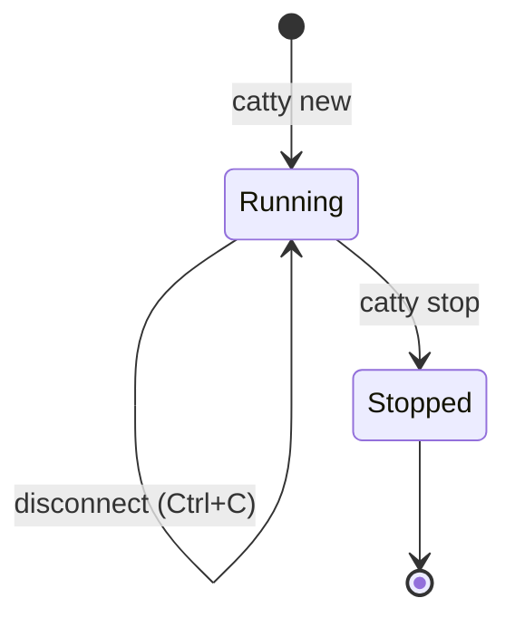

A session is an isolated cloud machine running Claude Code. Each session persists until you explicitly stop it, allowing you to disconnect and reconnect from anywhere.

## What is a Session?

When you run `catty new`, Catty:

1. Provisions a cloud machine (Debian-based, with dev tools pre-installed)
2. Uploads your workspace to `/workspace`
3. Starts Claude Code with your secrets as environment variables
4. Connects your terminal via WebSocket

The session continues running even when you disconnect.

## Session Labels

Each session gets a memorable label like:

- `brave-tiger-1234`
- `swift-falcon-5678`
- `clever-dolphin-9012`

Labels are easier to remember than UUIDs and used for all session operations:

```bash
catty connect brave-tiger-1234
catty stop brave-tiger-1234
catty download brave-tiger-1234
```

## Session Lifecycle



### Running

- Claude Code is active
- You can connect/disconnect freely
- Workspace saves to cloud every 30 seconds
- Sync-back sends file changes to your local machine

### Stopped

- Cloud machine is terminated
- Workspace snapshot remains in cloud storage
- Use `catty download` to retrieve files

## Persistence

Sessions persist until:

- You run `catty stop <label>`
- TTL expires (2 hours of inactivity)
- The machine crashes (rare)

This means you can:

- Start a session at work, close your laptop, reconnect from home
- Run long tasks and check back later
- Disconnect during network issues and reconnect when stable

## Multiple Sessions

Run multiple sessions in parallel for different projects:

```bash
# Terminal 1
cd project-a
catty new
# → brave-tiger-1234

# Terminal 2
cd project-b
catty new
# → swift-falcon-5678
```

List all sessions:

```bash
catty list
```

## Session Environment

Each session includes:

| Tool | Version |
|------|---------|
| Node.js | 22 |
| Git | Latest |
| GitHub CLI (`gh`) | Latest |
| Python | 3.x |
| ripgrep, jq, vim | Latest |
| Build tools | gcc, make |

Claude Code has access to all standard Unix tools. You can install additional packages with `apt-get`, `npm`, `pip`, etc. (installations don't persist across sessions).

## See Also

- [catty new](/cli/new) - Start a session
- [catty connect](/cli/connect) - Reconnect to a session
- [catty stop](/cli/stop) - Stop a session
- [Workspaces](/concepts/workspaces) - How file storage works
