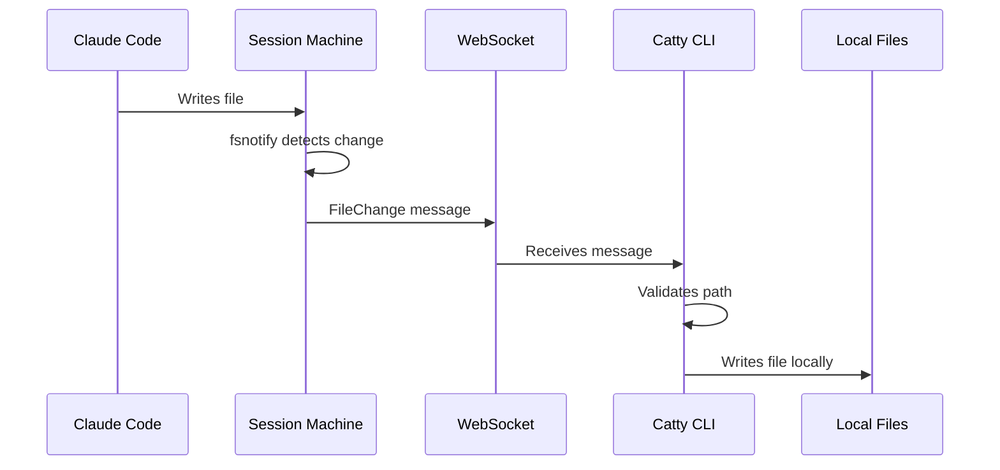

Sync-back automatically copies file changes from the remote session to your local machine in real-time. When Claude creates or modifies a file, it appears locally within seconds.

## How It Works



## Supported Operations

| Operation | Description |
|-----------|-------------|
| Create | New files appear locally |
| Modify | Changed files are updated |
| Delete | Deleted files are removed locally |

## Enabled by Default

Sync-back is enabled when you run:

```bash
catty new
catty connect <label>
```

## Disabling Sync-Back

For new sessions:

```bash
catty new --no-sync-back
```

When reconnecting:

```bash
catty connect brave-tiger-1234 --no-sync-back
```

### When to Disable

- Working on a large codebase where constant file writes are distracting
- Using version control and prefer to pull changes manually
- Testing or debugging sync-back issues

<Note>
  With sync-back disabled, use `catty download` or `catty sync` to retrieve files.
</Note>

## Security

Sync-back includes multiple safety measures:

<CardGroup cols={2}>
  <Card title="Path Validation" icon="shield-check">
    Rejects absolute paths and directory traversal (`../`) attempts.
  </Card>

  <Card title="Workspace Scoped" icon="folder">
    Only changes under `/workspace` are synced.
  </Card>

  <Card title="Local Boundary" icon="house">
    Writes are confined to your current working directory.
  </Card>

  <Card title="No Executables" icon="ban">
    File permissions are normalized (no executable bits set unexpectedly).
  </Card>
</CardGroup>

## Sync-Back vs Download/Sync

| Feature | Sync-Back | Download/Sync |
|---------|-----------|---------------|
| Timing | Real-time | On-demand |
| Direction | Remote → Local | Remote → Local |
| Requires connection | Yes | No |
| Overwrites local | Yes | Yes |

**Use sync-back** for live collaboration with Claude.

**Use download/sync** to retrieve files after disconnecting or if sync-back was disabled.

## Troubleshooting

### Changes Not Appearing

1. Check you didn't use `--no-sync-back`
2. Ensure Claude is editing files in `/workspace`
3. Verify you're in the correct local directory

### Files in Wrong Location

You may have reconnected from a different directory. Sync-back writes to your current working directory, not where you originally created the session.

### Conflicts

Sync-back is one-way (remote to local). If you edit a file locally while Claude edits it remotely, the remote version overwrites your local changes.

**Best practice**: Let Claude do the work during a session. Review when done.

## See Also

- [Workspaces](/concepts/workspaces) - Upload and cloud persistence
- [catty download](/cli/download) - Download on demand
- [catty sync](/cli/sync) - Sync on demand
