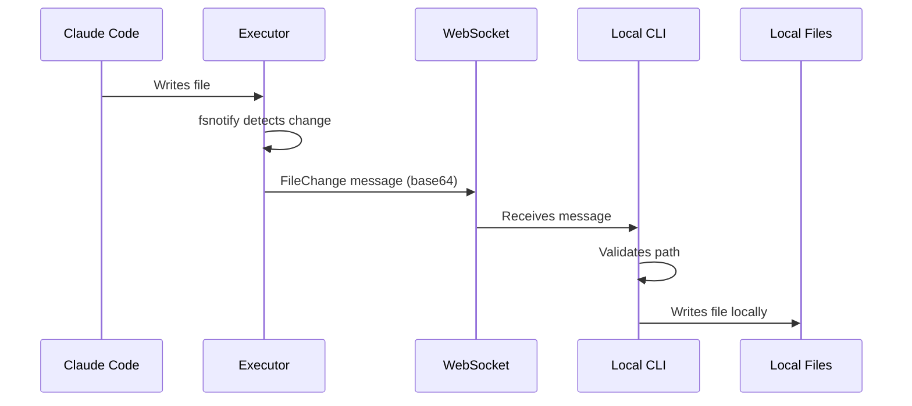

Catty provides bidirectional file synchronization between your local directory and the remote session, plus the ability to upload images and documents during a session.

## Upload (Local to Remote)

When you run `catty new`, your current directory is automatically zipped and uploaded to the remote session.

### What Gets Uploaded

Your entire current directory, **except**:

- Files matching patterns in `.gitignore`
- Default exclusions (see below)

### Default Exclusions

These patterns are always excluded, regardless of `.gitignore`:

```
.git/
.git/**
node_modules/
node_modules/**
__pycache__/
*.pyc
.venv/
venv/
.env
.DS_Store
*.log
```

<Tip>
  Add patterns to your `.gitignore` to exclude additional files from upload.
</Tip>

### Upload Limits

| Limit | Value |
|-------|-------|
| Maximum size | 100 MB |
| Uploads per session | 1 |

<Warning>
  If your workspace exceeds 100 MB, reduce its size by adding exclusions to `.gitignore` or use `--no-upload` and manually copy files.
</Warning>

### Skipping Upload

Start a session without uploading:

```bash
catty new --no-upload
```

Useful when:
- Your workspace is too large
- You want an empty session
- You'll clone a repo in the session instead

## File Upload (During Session)

You can upload images and documents to an active session by dragging and dropping file paths into your terminal.

### How It Works

1. Drag a file from Finder/Explorer into your terminal
2. The file path appears in the input
3. Press Enter - Catty detects the file and uploads it
4. The file is available at `/workspace/.catty-uploads/<filename>`
5. Claude can then view and work with the file

### Supported File Types

<CardGroup cols={2}>
  <Card title="Images" icon="image">
    PNG, JPG, JPEG, GIF, WEBP, BMP, SVG
  </Card>

  <Card title="Documents" icon="file">
    PDF, TXT, MD, JSON, XML, CSV
  </Card>
</CardGroup>

### Limits

| Limit | Value |
|-------|-------|
| Maximum file size | 10 MB |
| Supported paths | Absolute paths only |

### Examples

```bash
# Drag and drop a screenshot
/Users/you/Desktop/Screenshot 2024-12-17.png

# Upload a PDF for Claude to analyze
/Users/you/Documents/report.pdf

# Multiple files (space-separated)
/path/to/image1.png /path/to/image2.png
```

<Tip>
  Paths with spaces are automatically handled. Both `/path/to/my file.png` and `/path/to/my\ file.png` work.
</Tip>

## Sync-Back (Remote to Local)

Changes made by Claude in the remote `/workspace` directory are automatically synced back to your local directory in real-time.

### How It Works



### Supported Operations

| Operation | Description |
|-----------|-------------|
| Create | New files appear locally |
| Modify | Changed files are updated |
| Delete | Deleted files are removed locally |

### Security

Sync-back includes safety measures:

<CardGroup cols={2}>
  <Card title="Path Validation" icon="shield-check">
    Rejects absolute paths and directory traversal (`../`) attempts.
  </Card>

  <Card title="Workspace Scoped" icon="folder">
    Only changes under `/workspace` are synced.
  </Card>

  <Card title="Local Boundary" icon="house">
    Writes are confined to your current working directory.
  </Card>

  <Card title="Real-time" icon="bolt">
    Changes appear immediately as Claude makes them.
  </Card>
</CardGroup>

### Disabling Sync-Back

Disable for new sessions:

```bash
catty new --no-sync-back
```

Disable when reconnecting:

```bash
catty connect brave-tiger-1234 --no-sync-back
```

<Note>
  Disabling sync-back means you'll need to manually retrieve any files Claude creates or modifies.
</Note>

## Best Practices

<AccordionGroup>
  <Accordion title="Keep workspace under 100 MB">
    Use `.gitignore` to exclude large files, build artifacts, and dependencies. These can be regenerated in the remote session.
  </Accordion>

  <Accordion title="Leave sync-back enabled">
    The default behavior ensures your local copy stays in sync with Claude's changes. Only disable if you have a specific reason.
  </Accordion>

  <Accordion title="Check .gitignore before upload">
    Make sure your `.gitignore` excludes sensitive files like `.env` with secrets. These are excluded by default, but verify your specific setup.
  </Accordion>

  <Accordion title="Use version control">
    Since files sync in real-time, use Git to track changes and revert if needed. Commit your work before starting a session.
  </Accordion>
</AccordionGroup>
